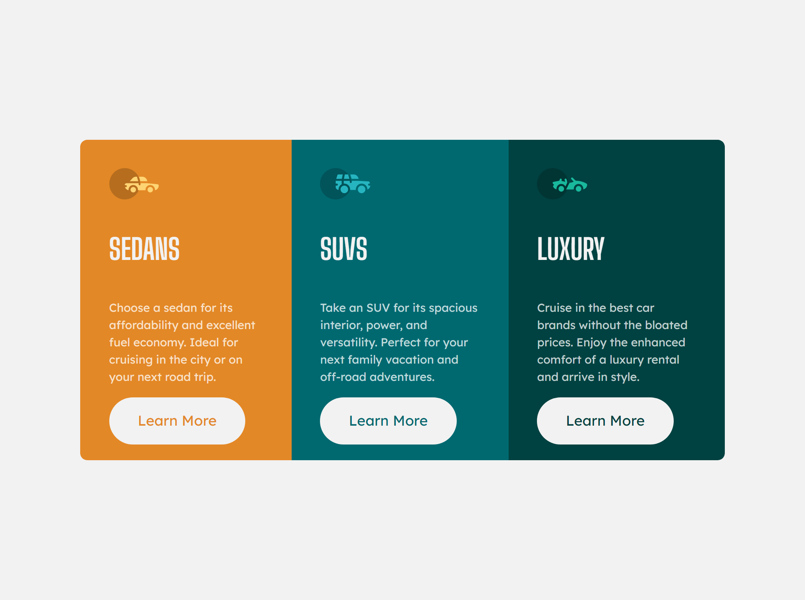

# Frontend Mentor - 3-column preview card component solution

This is a solution to the [3-column preview card component challenge on Frontend Mentor](https://www.frontendmentor.io/challenges/3column-preview-card-component-pH92eAR2-). Frontend Mentor challenges help you improve your coding skills by building realistic projects. 

## Table of contents

- [Overview](#overview)
  - [The challenge](#the-challenge)
  - [Screenshot](#screenshot)
  - [Links](#links)
- [My process](#my-process)
  - [Built with](#built-with)
  - [What I learned](#what-i-learned)
  - [Continued development](#continued-development)
- [Author](#author)


**Note: Delete this note and update the table of contents based on what sections you keep.**

## Overview

### The challenge

Users should be able to:

- View the optimal layout depending on their device's screen size
- See hover states for interactive elements

### Screenshot



### Links

- Solution URL: [https://github.com/ozanweb/3-column-preview-card-component-main]
- Live Site URL: [https://ozanweb.github.io/3-column-preview-card-component-main/]

## My process

### Built with

- Semantic HTML5 markup
- CSS
- Flexbox
- Display: table

### What I learned

A ```display: table``` method which can be used to align page both vertically and horizontally. This method works only if there is at least 3 containing elements such as; ```html```, ```body```, ```div```.
Rules are as follows;

```css
  html {
    position: absolute;
    display: table;
    top: 0;
    left: 0;
    width: 100%;
    min-width: /*enter yours*/;
    height: 100%;
  }
  body {
    display: table-cell;
    vertical-align: middle;
  }
  div {
    width: /*enter yours*/;
    margin: 0 auto;
  }
```
Vertical alignment can be achieved with ```display: flex``` property. Apply the following ruleset to the flex element;

```css
.parent {
  display: flex;
  width: /*enter yours*/;
  margin: auto; /* centers horizontally */
  height: 100%;
  align-items: center;
}
```


### Continued development

- Advancing in CSS table and CSS flexbox properties for vertical and horizontal alignment


## Author

- Frontend Mentor - [@ozanweb](https://www.frontendmentor.io/profile/ozanweb)
- LinkedIn - [@ozanpalanci](https://www.linkedin.com/in/ozanpalanci/)

